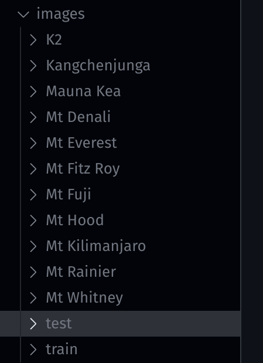
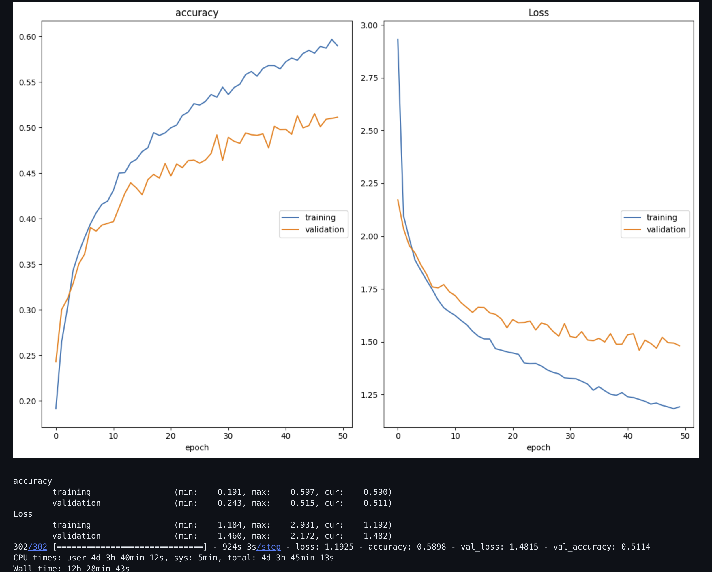
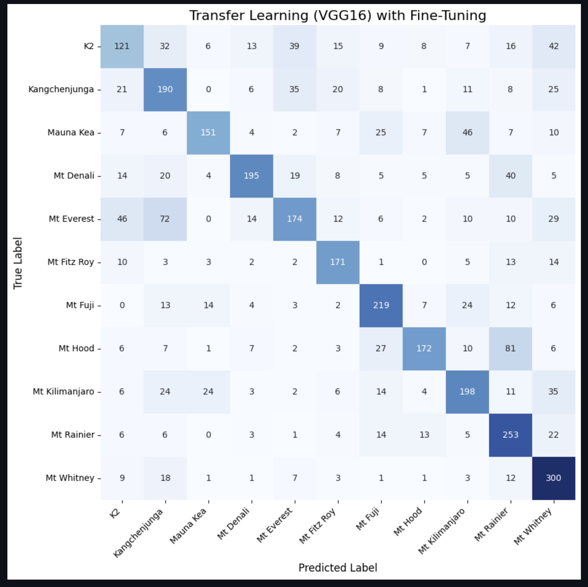
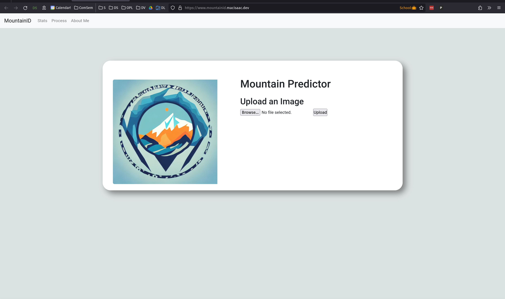

### Project Journey
When I first started this course, I knew I wanted to do something with images cause they were a data type I had never worked with before and I was a bit initimated by them. This led me into doing research into OpenCV and different types of image classification machine learning models. I followed a Coursera course about using OpenCV and ML. I learned alot about using OpenCV but didn't end up using much of this as TensorFlow has built in image preprocessing functions that worked a bit better with my data pipeline. I also did some research into certain ML models that work well for image classification. That being said, it gave me a much better understanding of how images are processed and used in a model which was valuable to know for this project. 

I started this project looking to build a site where a user could upload an image of a mountain and then it would predict which mountain it was. I figured I could get "50% accuracy but getting 70+ accuracy would be challenging". I initially wanted to get images from Instagram but soon found this to be infeasible as their API is very restrictive and they monitor data miners heavily. Due to this I shifted to looking into Flickr and I eventually ended up using their API. 

I first sought out to write a script to gather the data I needed. Since mountains don't exactly change or need live data, I pushed off adding a cloud function for downloading new images. I opted to write a script to download 100 images of each mountain at a time and track which page had been downloaded. This allowed me to run the program 15+ times to download about 1500 images of each mountain. 

I will talk more about this journey in the points below. 

### Data Focused
This project revolves entirely off data! Most of my time spent was spent working on mining data, preprocessing it, cleaning it, and using it for training, validating, and testing a ML model. 

### Original
As I was looking online for similar projects, I wasn't able to find anything comprable. The closest thing I found were two apps, both very similar to eachother, overlapped the names of mountains that you pointed your phone at (a sorta AR type app). This is similar to my project but those apps utilize mainly gps and compass data to predict which mountains are being shown rather than the actual images. I could not find a project that was actually predicting mountains based soley off the image. Due to this I would consider this project to be very original.

### Substantial
This project took a substanial amount of time because most of the technologies I used were new to me. The Flickr API was fairly easy to get going. But it took a good amount of work to get the preprocessing step of removing images that weren't mountains. I first used the OpenCV library that could try and detect people and remove images that had people but this didn't work great. I messed around with the parameters for a while but never got something great working. Based on advice during my mid project demo, I ended up using the base pretrained ImageNet model to predict if there was a mountain in each downloaded image. Because there were built in classifiers for things similar to mountains ("mountain", "alps", "mountain range", "rock face") I was able to check if the image had any of these and removed the image if it didn't. From looking over the deleted images, this seemed to do a much better job at ensuring that the dataset was made entirely of mountain images. 

Next I had to create a model. From research I discovered that using a pretrained model would train must faster and be more accuracte because they were trained on 1 million+ images already. From here I had to mess around alot with how to import the images into the system and how to break them up for training, validating, and testing. 

Here it shows how many images I had in training set, validation set, and testing set. 

I first tried doing preprocessing with OpenCV but this ended up not being needed and generally complicated things. I found out about DataGenerators which do most of the image handling and preprocessing for me. It also allowed me to split the testing set into testing/validating but it didn't allow me to create a testing set aswell. Because of this I had to write a function which took my images from each mountain subfolder and move a test split amount in a new testing subdirectory and the rest in the training subdirectory. This function also shuffled the images. 

Here is an image of what the subdirectories look like:

In the images directory there is a folder with the images for each mountains. My function then creates the test and train folders. These directories each have folders for each mountain with the images in them. These directories are then used in the training of the model and the testing of the model. 

Once I finally got the DataGenerators to correctly work with my images I followed a tutorial to setup the VGG16 pretrained model for training. (https://www.learndatasci.com/tutorials/hands-on-transfer-learning-keras/) I used alot of their code for this but I then fine tuned my inputs into the create_model function by testing on a smaller data set. I pretty quickly got a 70%+ accuracy on a group of 5 mountains with limited images. From there I added more mountains and fine tuned a bit more. I tested out unfreezing 3 and 1 layers on a smaller data set of the 11 final mountains I chose but those results proved to be not quite as good. I ended up sticking with unfreezing 2 layers and after training on my full size data set was able to achieve a 62% accuracy. 

Training: graphs of the accuracy and loss of my model as it trained:

Testing: I tested it on the test set (of 3460 fairly equally distributed images) and here is the output (ignore the "without fine tuning" I forgot to remove that print statement before running it for screenshots)

I didn't end up using an F1 test but I did use this heatmap function to generate this which shows that there is not much overpredicting for any one mountain:

This accuracy was in line with my project proposal hypothesis of how well I would be able to get my model. I do think there is room to improve this and get higher accuracy but I simply didn't have enough time to work on that. The training took 12+ hours so trying to test out different setting like the learning rate is very difficult and time intesive. 

My last few steps, although not terribly time demanding, were also completed as I setup my Flask App, deployed it to the cloud, and connected it up to my domain. 

Here is a screenshot of the site!

### Timely
This project is not as timely as I hoped it would be. I am using live data that I was able to pull right off of Flickr using their API but I currently don't have a pipeline setup to download new images of those moutains when uploaded to Flickr and then continue to train my model with them. This would be a great extension but I unfortanutely ran out of time this semester. 

### Deployed
My project is deployed! You can find it at https://www.mountainid.macisaac.dev. This was a fun learning experience of creating a flask app that incorporated my model and could predict based off user uploaded images. I ended up using the Google App Flex Engine as it made deployment of a Flask App very simple (with some adjustments because of TensorFlow issues). I may have to look into prices to keep the site up but for now its good. I also spent some time to connect the site up to the domain I own, macisaac.dev, which was a cool because I had not actually used my domain for anything other than email before now. 

### Closing
Due to github and internet limitations I have not uploaded my dataset nor trained models to GitHub yet. I will have to look into doing that so I can make this information public!

I truly enjoyed the process of learning new technologies through this project. It is beyond rewarding to be able to access my site from anywhere, throw in a mountain image, and (mostly) get an accurate prediction! I feel way more prepared for dealing with APIs, TensorFlow, OpenCV, Flask, GCP, and pretrained models now. 

I am so glad I had this opportunity. Thank you Gina for all the help in this class, and all others I took with you! I truly learn so much from your courses are I am very grateful to have been taught by you!

-Dominic

